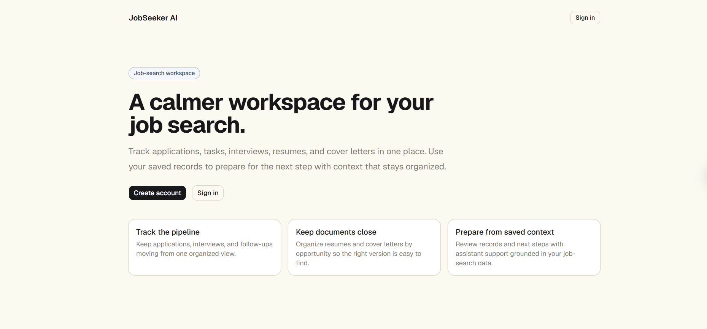
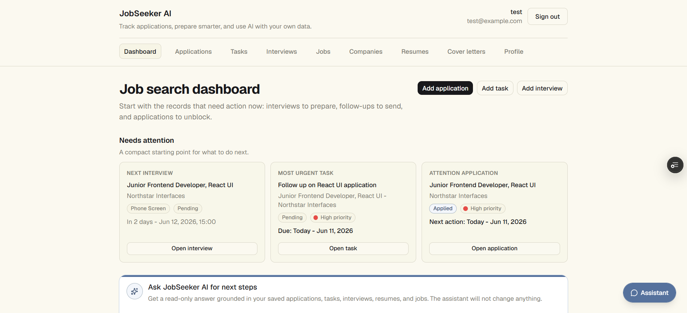
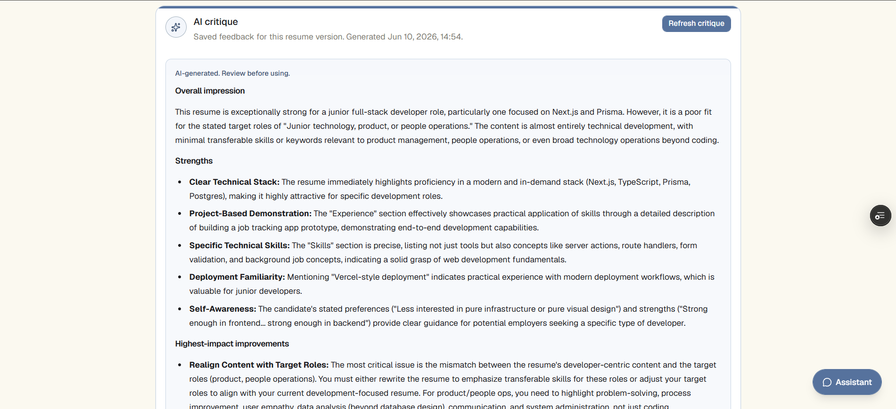
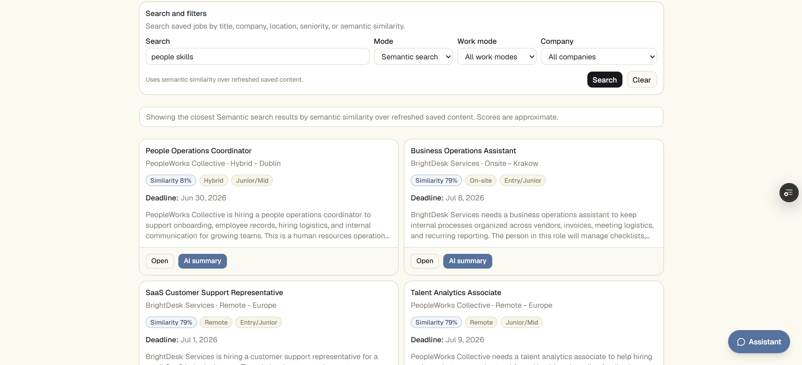
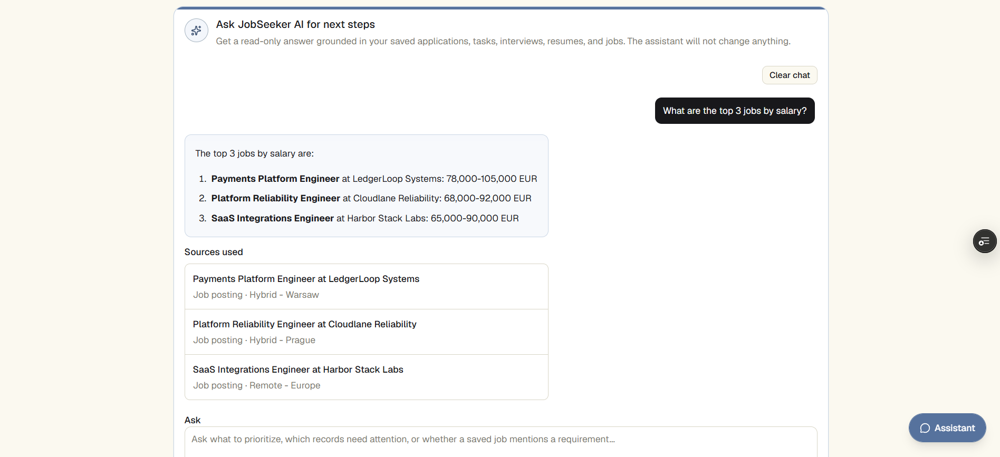

# JobSeeker AI

JobSeeker AI is a full-stack web application for managing a personal job search workflow. It helps users organize companies, job postings, applications, resumes, cover letters, interviews, and follow-up tasks in one authenticated workspace.

The application also includes AI-assisted features, semantic search, retrieval evaluation, and a read-only contextual assistant that can answer questions based on saved job-search records.

**Live app:** [JobSeeker AI](https://jobseeker-ai-xi.vercel.app/)  
**Project type:** Bachelor’s thesis project  
**Status:** Functionally complete

---

## Screenshots

### Public landing page



### Dashboard



### AI resume critique



### Semantic job search



### Contextual assistant with sources



---

## Overview

Job searching often involves many disconnected records: job descriptions, resume versions, cover letters, interview dates, follow-up tasks, and application statuses. JobSeeker AI brings these records together in a structured workspace and uses the saved data as context for AI support.

The goal of the project was to build a practical full-stack application that combines standard job-search tracking with AI and retrieval features in a way that remains user-scoped, explainable, and useful for real workflows.

---

## Key Features

### Job Search Management

- Email/password authentication with Better Auth
- Protected dashboard and authenticated app shell
- User profile and career context
- Company management
- Job posting management
- Application tracking with status, priority, notes, and next actions
- Resume management with manual entry and PDF upload
- Cover letter drafts and versioning
- Task tracking for follow-ups and preparation
- Interview tracking with preparation notes
- Search, filtering, pagination, and responsive layouts
- Delete confirmations and server-side validation
- Loading and pending states for search and AI actions

### AI Features

- Resume critique
- Cover letter critique
- Cover letter draft generation
- Job posting summary
- Resume-to-job match analysis
- Resume tailoring suggestions
- Interview preparation notes
- Read-only contextual assistant with page-aware answers and cited saved records

### Semantic Search and Retrieval

- Resume and job posting embeddings
- pgvector-based semantic retrieval
- Semantic search for saved job postings
- Semantic search for saved resumes
- Similar resumes for a selected job posting
- Similar saved jobs for a selected resume
- Hybrid keyword/semantic search for jobs and resumes
- Seeded semantic test data
- Retrieval evaluation script and report

---

## Tech Stack

- **Framework:** Next.js 16 with App Router
- **Language:** TypeScript
- **Styling:** Tailwind CSS
- **UI components:** shadcn/ui and Radix primitives
- **Authentication:** Better Auth
- **Database:** PostgreSQL on Neon
- **ORM:** Prisma 7
- **Vector storage:** pgvector in PostgreSQL
- **AI SDK:** Vercel AI SDK
- **AI provider:** Google Gemini
- **Embeddings:** `gemini-embedding-001`
- **File storage:** Vercel Blob
- **Validation:** Zod
- **Testing:** Playwright smoke tests
- **Deployment:** Vercel

---

## Main Entities

The application manages these core entities:

- **User** — authentication and career context
- **Profile** — job-search preferences and career information
- **Company** — companies of interest
- **JobPosting** — saved job descriptions linked to companies
- **Resume** — resume versions, PDF uploads, extracted text, and embeddings
- **Application** — job-search pipeline records
- **Task** — follow-ups and reminders, standalone or application-linked
- **Interview** — interview rounds linked to applications
- **CoverLetter** — application-specific cover letter drafts and versions

---

## Architecture Highlights

JobSeeker AI is built as a full-stack Next.js application.

Server Components are used for authenticated data loading, while Server Actions handle mutations such as creating records, updating records, deleting records, generating AI outputs, and refreshing semantic data.

The application uses PostgreSQL for relational data and pgvector for vector storage. Resumes and job postings are embedded because they contain the long free-text content most relevant for semantic search and matching. Other entities, such as applications, tasks, and interviews, are handled through structured relational context.

AI features are implemented server-side. The model does not directly access the database. Instead, the application gathers relevant user-owned records, formats the context, sends the necessary text to the AI provider, and saves or displays the generated result.

The contextual assistant uses a two-call structure:

1. The first model call determines what read-only application context is needed for the user’s question.
2. The server gathers the selected context using user-scoped read-only tools.
3. The second model call generates the final answer using the gathered context.
4. Source references are filtered through a trusted source registry before being shown to the user.

The assistant is intentionally read-only. It can help the user understand saved records and decide what to focus on next, but it cannot create, update, delete, send, or schedule anything.

---

## Technical Documentation

Additional technical documentation lives in:

```txt
docs/
```

Start with:

- [docs/README.md](docs/README.md)
- [docs/ai-system-overview.md](docs/ai-system-overview.md)
- [docs/ai-feature-inventory.md](docs/ai-feature-inventory.md)
- [docs/retrieval-architecture.md](docs/retrieval-architecture.md)
- [docs/evaluation-methodology.md](docs/evaluation-methodology.md)
- [docs/demo-readiness-checklist.md](docs/demo-readiness-checklist.md)

---

## Local Development Setup

### 1. Install dependencies

```bash
pnpm install
```

### 2. Configure environment variables

Create a `.env.local` file in the project root.

Required variables:

```env
DATABASE_URL=
DIRECT_URL=
BETTER_AUTH_SECRET=
BETTER_AUTH_URL=http://localhost:3000
GOOGLE_GENERATIVE_AI_API_KEY=
BLOB_READ_WRITE_TOKEN=
```

Notes:

- `DATABASE_URL` is the pooled Neon connection string used at runtime.
- `DIRECT_URL` is the direct Neon connection string used by Prisma CLI and migrations.
- `BETTER_AUTH_URL` should be `http://localhost:3000` during local development.
- `GOOGLE_GENERATIVE_AI_API_KEY` is required for Gemini generation and embeddings.
- `BLOB_READ_WRITE_TOKEN` is required for Vercel Blob resume PDF uploads.
- Do not commit real environment variable values.

### 3. Generate Prisma client

```bash
pnpm exec prisma generate
```

### 4. Run migrations

```bash
pnpm exec prisma migrate dev
```

### 5. Start the development server

```bash
pnpm dev
```

Open:

```txt
http://localhost:3000
```

---

## Useful Commands

Run the app locally:

```bash
pnpm dev
```

Run linting:

```bash
pnpm lint
```

Run production build:

```bash
pnpm build
```

Open Prisma Studio:

```bash
pnpm exec prisma studio
```

Run Playwright smoke tests:

```bash
pnpm exec playwright test tests/smoke.spec.ts --project=chromium
```

Seed semantic demo data for a local/development user:

```bash
pnpm seed:semantic-test-data --email test@example.com --reset-user-data
```

Backfill resume and job posting embeddings:

```bash
pnpm backfill:embeddings
```

Run retrieval evaluation:

```bash
pnpm evaluate:retrieval --email test@example.com --write-report
```

---

## Demo Data and Retrieval Evaluation

The project includes a semantic test dataset and retrieval evaluation workflow.

The semantic demo data creates realistic job-search records, including companies, job postings, resumes, applications, tasks, and interviews. This data is used to test whether semantic search and similar-record retrieval return expected results.

Typical demo/evaluation flow:

```bash
pnpm seed:semantic-test-data --email test@example.com --reset-user-data
pnpm backfill:embeddings
pnpm evaluate:retrieval --email test@example.com --write-report
```

The retrieval evaluation checks whether expected resumes and job postings appear in the top results for predefined semantic queries.

---

## Database and Prisma Notes

The Prisma schema lives in:

```txt
prisma/schema.prisma
```

The Prisma client is generated into:

```txt
src/generated/prisma
```

The database uses PostgreSQL on Neon with pgvector enabled for resume and job posting embeddings.

Migration approach:

- Migrations are run manually from the local development machine.
- Vercel builds run Prisma generation, not database migrations.
- `DIRECT_URL` is used for migration-related Prisma CLI work.
- `DATABASE_URL` is used by the runtime application.

---

## File Upload Notes

Resume PDF upload uses Vercel Blob.

Current behavior:

- Users can create resumes manually by pasting text.
- Users can upload a PDF resume.
- Uploaded PDFs are stored in Vercel Blob.
- Text is extracted from the PDF and saved into `Resume.content`.
- If extraction fails or produces no usable text, the user can use manual text fallback.

Known limitations:

- Scanned or image-only PDFs may not produce useful extracted text.
- Replacing a PDF stores a new file but does not yet delete the old Blob object automatically.

---

## Testing Notes

The project includes minimal Playwright smoke tests.

These tests check:

- Sign-in page rendering
- Sign-up page rendering
- Redirect behavior for signed-out users trying to access protected pages

The main project verification also includes manual QA, AI feature checks, semantic retrieval evaluation, and production build checks.

---

## Deployment Notes

The app is deployed on Vercel.

Vercel is connected to the GitHub repository:

- Pushes or merged pull requests to `main` trigger production deployment.
- Feature branches and pull requests can create preview deployments.

Required Vercel environment variables:

```env
DATABASE_URL=
BETTER_AUTH_SECRET=
BETTER_AUTH_URL=
GOOGLE_GENERATIVE_AI_API_KEY=
BLOB_READ_WRITE_TOKEN=
```

`DIRECT_URL` is not required on Vercel because migrations are run locally, not during Vercel builds.

---

## Development Workflow

The project uses a feature-branch and pull-request workflow.

Typical workflow:

```bash
git checkout main
git pull
git checkout -b feature/example-feature
```

After implementation:

```bash
pnpm lint
pnpm build
git status
git add .
git commit -m "feat: describe change"
git push -u origin feature/example-feature
```

Then open a GitHub pull request, review the diff, merge into `main`, and pull locally:

```bash
git checkout main
git pull
git branch -d feature/example-feature
```

---

## Project Status

JobSeeker AI is functionally complete as a bachelor’s thesis project.

Implemented areas include:

- authenticated user-scoped CRUD workflows
- responsive application shell and dashboard
- resume PDF upload and text extraction
- server-side validation and ownership checks
- AI-assisted resume, cover letter, job, match, tailoring, and interview features
- resume and job posting embeddings
- semantic search and similar-record retrieval
- retrieval evaluation with seeded test data
- read-only contextual assistant with source references
- final UI polish, loading states, and demo-ready data

Possible future improvements include:

- persistent assistant conversation history
- write-capable assistant tools with explicit confirmation
- background embedding refresh
- larger retrieval evaluation dataset
- authenticated private download route for stored PDFs
- automatic cleanup of replaced Blob files
- broader production hardening and monitoring
